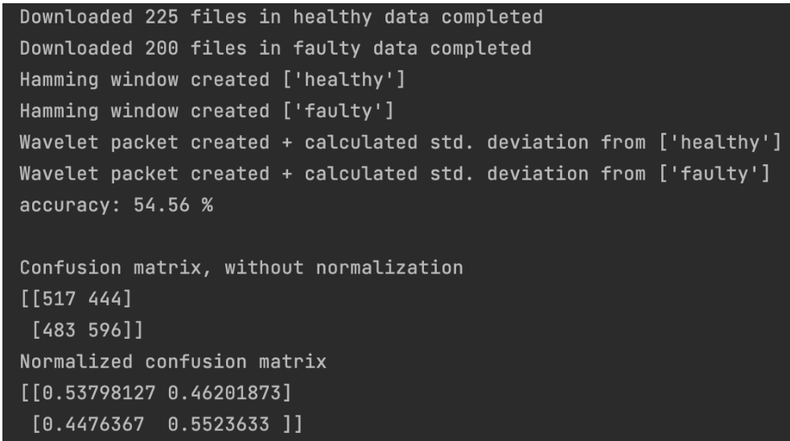
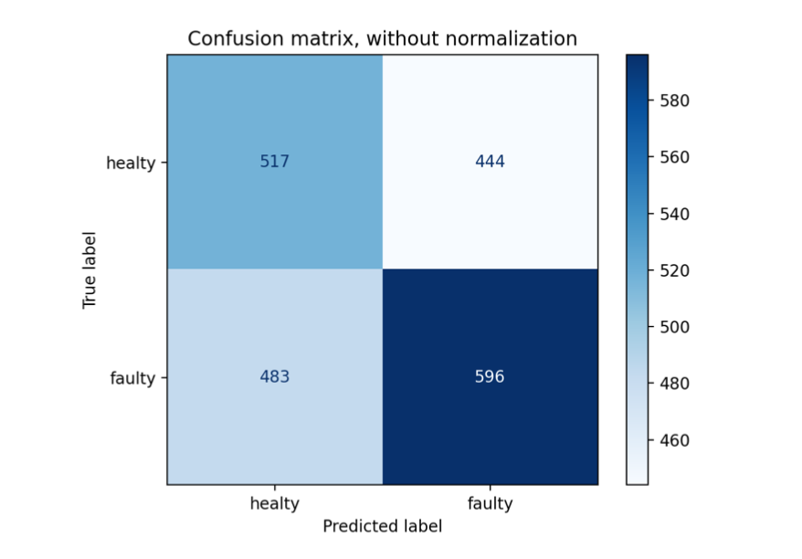
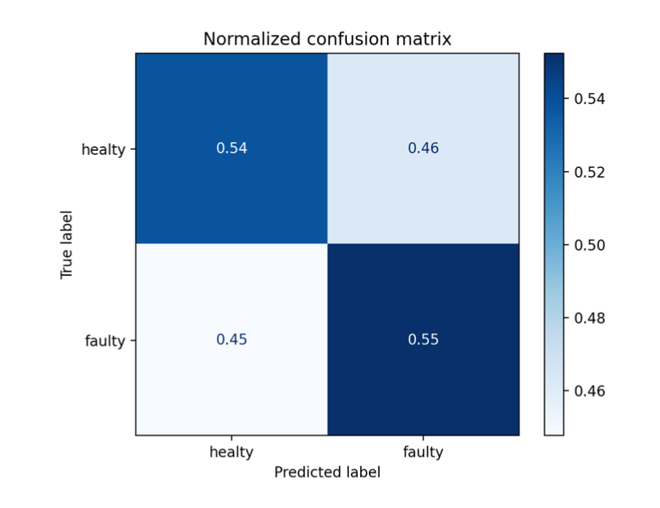

Rotor damage detection system by using artificial intelligence.
---
This program was created on the basis of a project implemented during the sixth semester of studies in the field of automation and robotics.  
Using artificial intelligence algorithms (Random Forrest), we are analyzing the current flowing through the engine that drives the drone.  Then we check whether it is possible to obtain a model that allows detecting rotor devices with satisfactory accuracy. In order to obtain more information about the project and the code written, please read the file "Report.pdf" (file in Polish).

## Table of Contents

- [Descripition](#description)

- [Measurements](#measurements)

- [Choosing the right method of work](#choosing-the-right-method-of-work)

- [Wavelet](#wavelet)

- [Results](#results)

- [Summary of results](#summary-of-results)

- [Bibliography](#bibliography)

## Description

The purpose of the following test is to create a model that allows for the detection of damage to unmanned aircraft propellers. This work is an extension of the engineering work of Mr. Paweł Drapikowski (Poznań University of Technology). The technical condition of the propellers was verified by using a module created by Mr. Paweł Drapikowski, which read the current flowing through the winding of the BLDC motor. Using a script written in Matlab, we collected data during laboratory measurements of rotor operation with different types of propellers in terms of wear.

## Measurements
During the laboratory test, we connected a propeller in very good mechanical condition and a propeller that was already broken to the attached unmanned aerial vehicle engine.
The tests consisted in sampling the signal generated by the motor current and then saving them to a csv file. We collected 225 files for a healthy propeller and 200 files for a damaged propeller. Each file was a vector consisting of 1 column and 2000 rows.

## Choosing the right method of work
In order to be able to automatically detect damage to rotor propellers, we decided to use machine learning algorithms. We decided to use the random forest method, i.e. the machine learning method, consisting in constructing many decision trees during training and generating a class that is the dominant of classes (classification) or the predicted mean (regression) of individual trees.

## Wavelet
Data preparation for further processing consisted in the use of wavelet decomposition - each window calculated from .csv files was cut into smaller fragments using the Wavelet Packet function from the pywt library. In our code, we used a level 4 decomposition - eventually 1 window was cut into 2 ^ 4 = 16 packets. Then, the standard deviation from each package was calculated and passed on to the classifier.

## Results
 
The program first downloads data from folders and saves them to the specific objects. Then the Hamming window is calculated and a Wavelet is created. In sequence, the standard deviation is calculated. After that we are determining certain characteristics that will make it possible to identify the signal. Then the program informs with what accuracy the model is able to indicate a damaged propeller. Finally, the result matrices are created, which are additionally presented in a graphical form (as shown below).

 
 

Interpretation of the obtained results is not satisfactory. On average, we get an accuracy score of 55%. 

## Summary of results
The research on the model as well as the selection of appropriate settings did not allow us to obtain satisfactory accuracy. Overall, by examining the mean value of all measurements, we obtain an accuracy of 54.03%. The accuracy achieved with our basic model was 53.93%.The specificity of the conditions doesn't allow us to efficiently use the model, because in the case of choosing 1 of 2 options, the accuracy of approximately 54% means that it is a choice close to randomness. In the case of this work, the model did not work for the given conditions. However, it allowed us to acquire a large amount of knowledge from the field of artificial intelligence.

## Bibliography
- www.pywavelets.readthedocs.io/en/latest/
- www.scikit-learn.org/stable/modules/generated/sklearn.ensemble.RandomForestClassifier.html 
